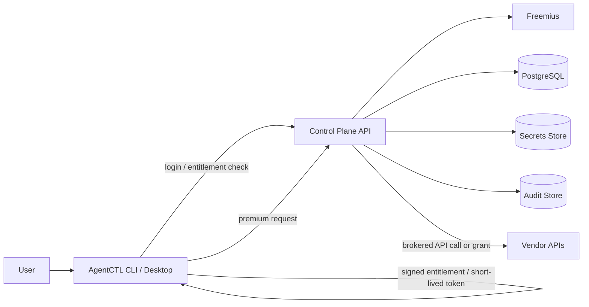

# AgentCTL Control Plane Spec

Status: Draft
Date: 2026-05-23

## Purpose

Build a single hosted control plane for AgentCTL that manages:

- Freemius subscription and license state
- customer accounts and organization membership
- package entitlements for Pro / Team / Enterprise bundles
- API token brokerage and quota enforcement
- package registry and curated bundle distribution
- audit trails for enterprise customers

The client application remains a thin consumer of signed entitlements and short-lived access grants. The client must not contain vendor secrets or payment credentials.

## Goals

1. Keep all sensitive credentials out of the CLI and desktop app.
2. Use Freemius for billing, renewals, checkout, and license status.
3. Let the control plane decide what a customer is entitled to use.
4. Support reselling of packages, API access, and enterprise add-ons.
5. Keep the client simple: login, fetch entitlement, unlock features.
6. Run the control plane on Kubernetes with a small number of services.

## Non-Goals

- No direct embedding of Freemius secrets in the client.
- No long-lived vendor API keys in the client.
- No requirement that the client itself understands billing logic.
- No attempt to make the local app unbreakable against a determined attacker.

## Existing Product Anchors

- Package manifests already exist in [examples/packages/pro-dev.md](examples/packages/pro-dev.md).
- The config layer understands package documents in [internal/config/schema.go](internal/config/schema.go).
- The current client already has a clean config/secrets seam in [internal/ports/ports.go](internal/ports/ports.go).
- Agent execution and feature gating can be enforced in the runtime paths under [internal/engine/](internal/engine/).

## High-Level Architecture



The control plane is the source of truth for who can use what. The client only receives signed, time-limited grants.

## Service Boundaries

### 1. API Gateway

Single public entry point for:

- login and session bootstrap
- entitlement lookup
- package listing and package assignment
- token broker requests
- admin operations for org owners

### 2. Freemius Webhook Receiver

Consumes subscription events from Freemius:

- purchase created
- subscription renewed
- subscription cancelled
- payment failed
- license activated / revoked

This service updates internal entitlement records. It should be idempotent.

### 3. Entitlement Service

Computes effective access for a user or organization:

- allowed packages
- allowed models/providers
- API usage quota
- seat count
- expiry time
- revocation state

Returns a signed entitlement document to the client.

### 4. Token Broker

Holds vendor credentials in the control plane only and issues one of:

- a proxied completion request
- a short-lived downstream token
- a usage-bound temporary grant

This is the component that protects paid API tokens from unpaid use.

### 5. Package Registry

Stores curated bundles such as:

- development pack
- QA pack
- security / pen-test pack
- enterprise admin pack

These bundles map to package manifests in the client and to entitlement keys in the control plane.

### 6. Audit Service

Stores:

- entitlement changes
- license activations and revocations
- token issuance
- package assignment changes
- admin actions

## Trust Model

### Client Trust

The client should be treated as untrusted for enforcement purposes.

It may:

- inspect local files
- cache entitlements
- refuse to run premium features when unauthenticated

It must not:

- store Freemius secrets
- store vendor API secrets for paid API brokerage
- make the final authorization decision for paid usage

### Control Plane Trust

The control plane is trusted to:

- validate Freemius state
- sign entitlements
- hold vendor keys
- meter usage
- revoke access

## Entitlement Model

An entitlement is a signed claim set with:

- subject: user or organization id
- plan: free, pro, team, enterprise
- packages: allowed package names
- providers: allowed providers or model families
- quota: token or request budget
- expiry: time limit
- nonce / version: for revocation and rotation

Suggested shape:

```json
{
  "sub": "org_123",
  "plan": "team",
  "packages": ["pro-dev", "qa-suite"],
  "providers": ["openai", "anthropic"],
  "quota": {"requests": 100000, "tokens": 5000000},
  "exp": "2026-06-23T00:00:00Z",
  "ver": 7,
  "sig": "ed25519:..."
}
```

The client caches this locally and uses it for gating. The signature is verified against a public key shipped with the client.

## Freemius Integration

Freemius should be used for:

- checkout
- subscriptions
- renewals
- refunds
- license activation
- license revocation

The control plane stores no Freemius secret in the client. Instead:

1. Freemius sends webhook events to the control plane.
2. The control plane verifies the event signature.
3. The control plane maps the license to a user or org.
4. The entitlement record is updated.
5. The client receives a signed entitlement on next login or refresh.

## API Token Brokerage

This is the mechanism for preventing unpaid use of paid API capacity.

### Option A: Proxy Mode

The control plane owns vendor keys and forwards requests to the upstream provider.

Pros:

- simplest enforcement
- no vendor secrets in client
- easiest quota tracking

Cons:

- you pay the upstream bill first
- you need reliable metering and billing recovery

### Option B: Minted Downstream Grants

The control plane issues short-lived tokens or signed request grants that vendor integrations accept.

Pros:

- lower operational load on your proxy
- better for enterprise integrations

Cons:

- only works where the downstream system supports it
- more integration complexity

### Recommended First Version

Start with Proxy Mode for premium API access. It is the only model that fully prevents unpaid token consumption while keeping vendor secrets out of the client.

## Package Model

Packages should stay curated and opinionated.

Examples:

- `pro-dev` — coder, reviewer, code-review skill, GitHub integration
- `qa-suite` — test-oriented agents, validation helpers, report generation
- `security-suite` — pen-test and hardening agents, policy helpers, audit outputs
- `enterprise-admin` — org management, policy, audit, fleet configuration

The client reads package manifests from [examples/packages/](examples/packages/) and maps them to remote entitlements from the control plane.

## Client Flow

1. User signs in or activates a license.
2. Client sends Freemius license or session token to the control plane.
3. Control plane validates subscription state.
4. Control plane returns a signed entitlement.
5. Client caches entitlement locally.
6. Client checks entitlement before showing or running paid features.
7. Premium API calls are proxied through the control plane.

## Enforcement Points

The client must block premium access in three places:

1. UI and command discovery
2. command execution path
3. runtime tool or provider selection path

That means a premium package should not appear usable unless entitlement is valid, and even if invoked directly, the runtime should reject it.

## Kubernetes Deployment Shape

Suggested initial deployment:

- `control-plane-api` Deployment
- `freemius-webhook` Deployment or same service path
- `token-broker` Deployment
- `audit-worker` Deployment
- PostgreSQL StatefulSet or managed Postgres
- Redis for caching and rate limiting
- Secret store integration, ideally external secrets or cloud KMS

Ingress should terminate TLS and route all public traffic through a single API domain.

## Data Model

Minimum tables:

- `users`
- `organizations`
- `org_members`
- `licenses`
- `entitlements`
- `packages`
- `package_assignments`
- `api_tokens`
- `usage_events`
- `audit_events`
- `vendor_credentials`

Key relationships:

- one user can belong to many orgs
- one org can own many licenses
- one license can map to one or more entitlements
- one entitlement can unlock many packages
- one package can require one or more entitlement keys

## Security Requirements

- No vendor secrets in the client repository or binary.
- No Freemius secret in the client repository or binary.
- All entitlement payloads must be signed.
- Signed entitlements must expire.
- Revocation must be possible before expiry.
- Admin actions must be audited.
- Token brokerage must be rate limited and logged.

## Suggested Client API

Endpoints:

- `POST /v1/auth/freemius/activate`
- `POST /v1/auth/refresh`
- `GET /v1/entitlements/me`
- `GET /v1/packages`
- `POST /v1/broker/llm`
- `POST /v1/broker/mcp`
- `POST /v1/admin/orgs/:id/packages`

## Suggested Client Behavior

The client should expose:

- `m login`
- `m license activate`
- `m packages`
- `m packages install pro-dev`
- `m status` or `m doctor` showing entitlement state

When a user is not entitled:

- premium packages should show as locked
- premium commands should refuse to run
- premium API usage should fail before sending upstream traffic

## Rollout Plan

### Phase 1

- entitlement check only
- package locking
- Freemius webhook sync

### Phase 2

- token broker with proxy mode
- usage metering and quota enforcement
- org seats and team plans

### Phase 3

- enterprise admin UI
- audit exports
- package marketplace / reseller flows

## Open Questions

1. Should customers bring their own API keys for free usage, or should all paid provider use go through the control plane?
2. Do we want direct client login, or license-key-only activation for the first release?
3. Should packages be sold as one-time bundles, subscriptions, or both?
4. Do we want a separate enterprise admin UI from the start, or only an API first?

## Immediate Next Steps

1. Define the entitlement payload and signing scheme.
2. Define the first control-plane API contract.
3. Define the database schema for licenses, entitlements, and package assignments.
4. Define the first proxy flow for paid API use.