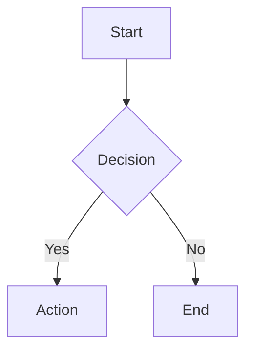

When asked to create a diagram, architecture overview, flow chart, sequence diagram,
or any visual representation, produce a Mermaid diagram in a fenced code block:



## Diagram types you can use:

- `graph TD` or `graph LR` — flowcharts (top-down or left-right)
- `sequenceDiagram` — interaction between components
- `classDiagram` — types and relationships
- `stateDiagram-v2` — state machines
- `erDiagram` — entity relationships
- `gantt` — timelines and schedules
- `pie` — proportions
- `C4Context` / `C4Container` — C4 architecture diagrams

## Rules:

1. Always use fenced ```mermaid code blocks
2. Keep diagrams readable — max 15-20 nodes per diagram
3. Use descriptive labels, not single letters
4. For complex systems, break into multiple diagrams (overview + detail)
5. Save diagrams to files with fs_write when asked (use .md extension)
6. If the user asks to "visualize" or "draw" something, default to mermaid
